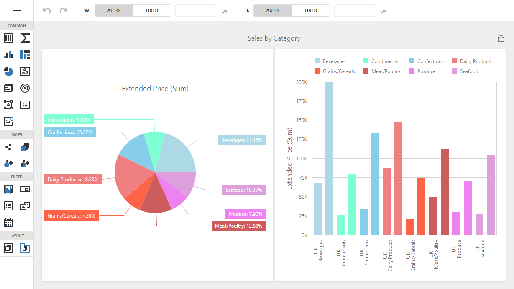
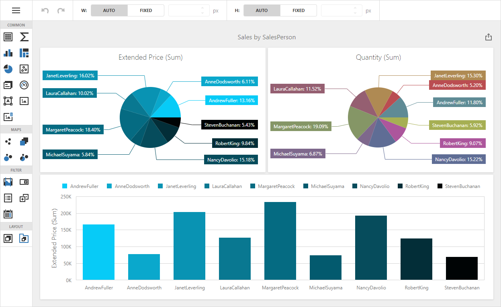

# Dashboard for ASP.NET Core - How to Customize the Color Palette

This example illustates how to customize the color palette for dashboard items in the Web Dashboard.

Restore npm packages to launch the project. Note that the script version on the client must match the version of libraries on the server.

## Overview

### Sales by Category Dashboard

In the *Sales By Category* dashboard, the [DashboardConfigurator.CustomPalette](xref:DevExpress.DashboardWeb.DashboardConfigurator.CustomPalette) event is used to substitute the default palette with a custom one.
Both dashboard items use the global color scheme.

### Sales by SalesPerson Dashboard

In the *Sales By SalesPerson* dashboard, the color palette is changed in the UI. The pie dashboard item (Quantity) uses the local color scheme, other two dashboard items use the global color scheme. 

## Files to Look At

- [Program.cs](./CS/WebDashboardCustomColorPalettes/Program.cs)

## Documentation

- [Coloring Basics](https://docs.devexpress.com/Dashboard/116915)
- [Coloring in the Web Dashboard](https://docs.devexpress.com/Dashboard/117152)

